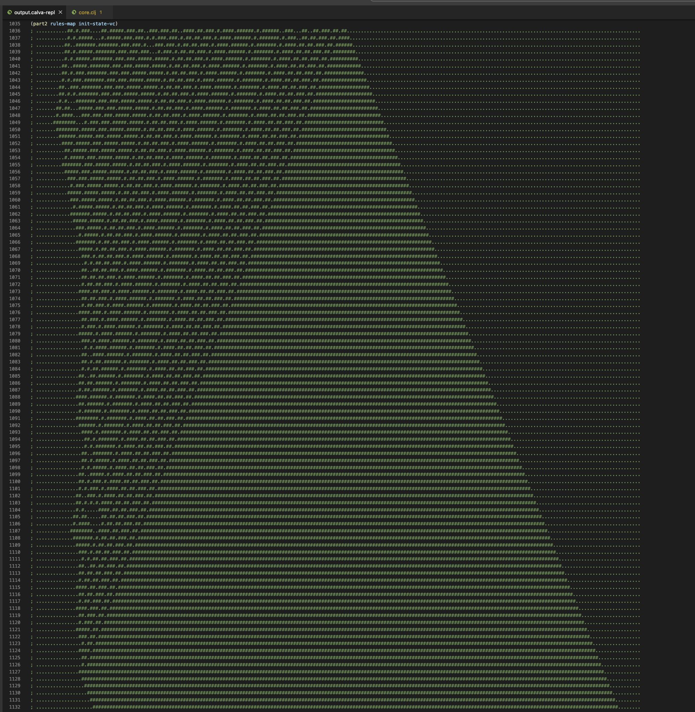

# Day 12: Subterranean Sustainability

Another step simulation with carefully crafted input

## Part 1

A simple brute-force approach. I typically like to write a function that takes same input format as it returns as output, so that I can use it alongside higher-order `iterate` function. I used a vector of ones and zeros to represent initial state, wrote helper functions to convert to/from string, and used `partition` to produce a sequence to 5-element vectors. Each sequence element then simply maps to a rules-map, which does not change, and returns plant (or no plant) position for the next generation.

## Part 2

This just took a bit of work to visualize the pattern that becomes evident after only 100 generations. 



I didn't bother with tests or code cleanup as I'm doing this on my summer vacation.

## Runtime 

```
> java -jar target/uberjar/day12-0.1.0-SNAPSHOT-standalone.jar

"Elapsed time: 7.536458 msecs"
Part 1:  6201
Part 2:  9300000001023
```
